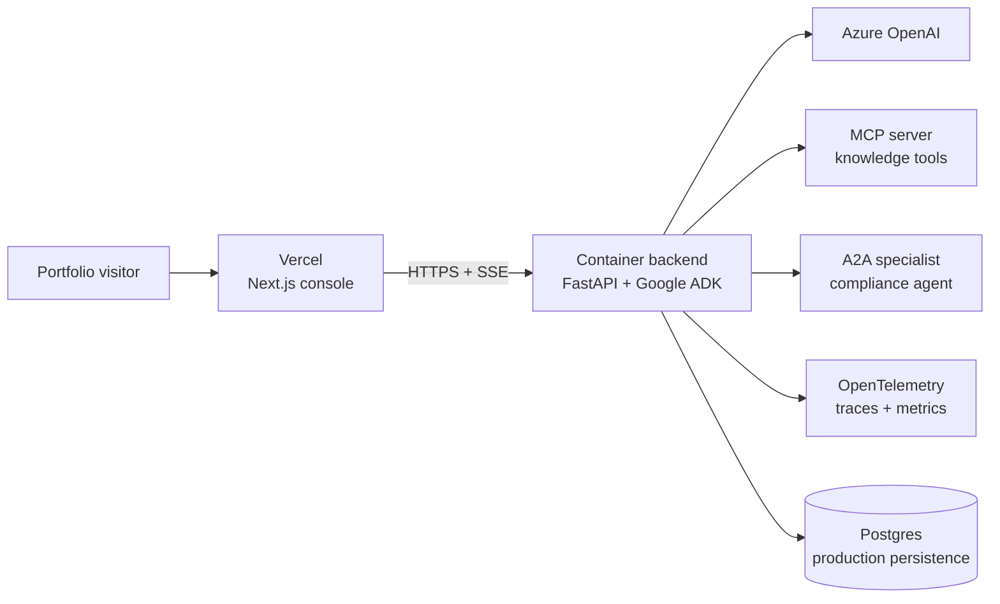

# AgentOps Command Center

Enterprise multi-agent intelligence platform built as a split deployment: a Next.js monitoring console on Vercel and a FastAPI orchestration service on a container runtime.

## Production architecture



## What is implemented

- A production-oriented Next.js App Router console with responsive workflow graph, live telemetry, trace IDs, agent timing, token and cost estimates, MCP/A2A integrations, and quality-loop status.
- A FastAPI backend with `POST /api/runs`, `GET /api/runs/{id}/events` Server-Sent Events, health/readiness endpoints, bounded rate limiting, input limits, and CORS allowlisting.
- Explicit sequential, parallel, and loop orchestration stages. Parallel specialists execute concurrently and their outputs are merged into shared run state.
- MCP tool telemetry and an A2A-compatible agent card at `/.well-known/agent.json`.
- Azure OpenAI configuration is server-only. When Azure credentials are absent, local demo mode still exercises the workflow and telemetry contract without incurring LLM cost.

## Local development

```powershell
npm install
Copy-Item .env.example .env.local
npm run dev
```

The console runs at `http://localhost:3000`. For a live backend stream, install the backend dependencies and start the API in a second terminal:

```powershell
python -m venv backend/.venv
.\backend\.venv\Scripts\Activate.ps1
pip install -r backend/requirements.txt
uvicorn app.main:app --app-dir backend --reload --port 8080
```

Set `NEXT_PUBLIC_API_BASE_URL=http://localhost:8080` in `.env.local` to connect the console to the API. Without it, the UI uses a bounded local observability demo so the portfolio experience remains inspectable.

## Deployment

### Vercel frontend

1. Import this repository into Vercel and select the Next.js framework.
2. Set `NEXT_PUBLIC_API_BASE_URL` to the public HTTPS URL of the backend container.
3. Configure the variable for Preview and Production environments separately when their backend URLs differ.
4. Deploy. The production target is `https://agentops-command-center.vercel.app` once that project/domain is assigned in Vercel.

### Backend container

Build and deploy the `backend/Dockerfile` to Cloud Run or Azure Container Apps. Both platforms support long-running FastAPI processes and SSE more reliably than Vercel serverless functions.

```powershell
docker build -t agentops-api ./backend
docker run --env-file .env --publish 8080:8080 agentops-api
```

The container must expose port `8080`, keep the public API on HTTPS, and allow the Vercel origin through `CORS_ORIGINS`. Use a managed Postgres database in production; the current in-memory run store is intentionally a local/demo adapter and must be replaced by the repository abstraction before production persistence is enabled.

### Environment variables

Copy `.env.example` and provide values in the platform secret managers. Only `NEXT_PUBLIC_API_BASE_URL` is browser-visible. Never use `NEXT_PUBLIC_` for credentials.

- `NEXT_PUBLIC_API_BASE_URL`: backend HTTPS base URL.
- `AZURE_OPENAI_ENDPOINT`, `AZURE_OPENAI_API_KEY`, `AZURE_OPENAI_DEPLOYMENT`, `AZURE_OPENAI_API_VERSION`: server-side Azure OpenAI configuration.
- `CORS_ORIGINS`: comma-separated local, preview, and production frontend origins.
- `DATABASE_URL`: production Postgres connection string; SQLite is suitable only for local development.
- `MCP_SERVER_URL`, `A2A_COMPLIANCE_AGENT_URL`: deployed integration endpoints.
- `OTEL_EXPORTER_OTLP_ENDPOINT`: optional OpenTelemetry collector endpoint.

### MCP and A2A

Run the MCP service beside the backend or as its own private service, then set `MCP_SERVER_URL`. Its tools should be backed by curated demo data for reliable portfolio demonstrations. Deploy the compliance specialist as a separate HTTP A2A service and set `A2A_COMPLIANCE_AGENT_URL`; the agent must expose its agent card and task endpoint over HTTPS.

### Health checks and troubleshooting

- `GET /health` checks process availability.
- `GET /ready` reports API, database adapter, Azure configuration, MCP, and A2A readiness without disclosing secrets.
- Browser run failures usually indicate an incorrect `NEXT_PUBLIC_API_BASE_URL`, missing CORS origin, or an unhealthy backend.
- SSE requires the backend proxy to preserve `text/event-stream` and disable response buffering.
- Keep Azure credentials in Vercel/backend secret stores, never in Git or frontend environment variables.

### Custom domains

Attach `agentops-command-center.vercel.app` to the Vercel project and link `msimsek.nl` from the portfolio. Keep the API on a separate backend hostname and use HTTPS for every browser-facing request.

## Validation

```powershell
npm run lint
npm run typecheck
npm run build
pytest backend/tests
```

Before calling the deployment complete, verify the production URL manually: launch a run, confirm sequential/parallel/loop telemetry, check MCP and A2A events, inspect trace and cost metrics, and test desktop/mobile layouts. A Vercel project and cloud backend deployment require account access and credentials and therefore cannot be created from this workspace alone.
